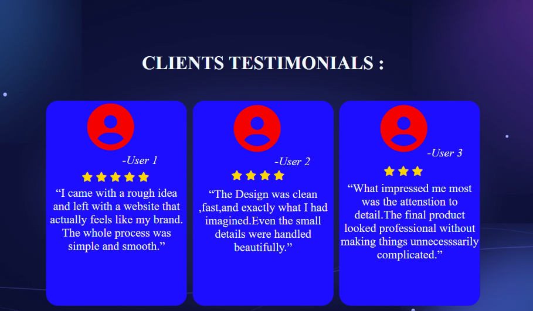

# 💬 Testimonial Cards

### Responsive • Animated • Interactive

A modern testimonial section built to present customer feedback and create trust through social proof.

---

## ✨ About the Project

**Testimonial Cards** are an important component of many websites because they provide **social proof**. Customer experiences help visitors build trust in a product, service, brand, or business and can increase confidence in taking action.

This project focuses on creating a clean testimonial UI that works across desktop and mobile devices.

## 🖼️ Project Preview

## 🚀 Features

- ⭐ User ratings and testimonials
- 👤 Profile/user sections
- 📱 Responsive mobile layout
- ✨ Hover animations
- 🔄 CSS transform effects
- 🎬 Smooth transitions
- 📐 Flexbox layout
- 🌌 Animated background

## 🧠 Concepts Used

- **Flexbox** — card layout and alignment
- **Media Queries** — responsive mobile design
- **Transitions** — smooth UI changes
- **Transformations** — movement and 3D effects
- **Animations** — interactive visual effects
- **Responsive Design** — adapting the UI to different screen sizes

## 🛠️ Main Challenge

The biggest challenge was making the cards **responsive on mobile phones**.

The original desktop layout did not fit properly on smaller screens. I solved this using **CSS Media Queries**, adjusting the layout and card dimensions according to the screen width.

This project helped me understand that:

> **A good website should not only look good on desktop — it should adapt to the device being used.**

## 📚 What I Learned

- How to build responsive layouts
- How to use Flexbox effectively
- How Media Queries solve mobile layout problems
- How `transition` and `transform` create interactive UI
- How animations can improve user experience
- How to debug responsive CSS issues

## 💻 Tech Stack

**HTML5** • **CSS3**

## 🔗 Links

📂 **Source Code:** `ADD YOUR GITHUB REPOSITORY LINK`

🌐 **Live Demo:** `ADD YOUR DEPLOYED LINK`

---

### 💙 Built while learning by building.

**More projects coming soon 🚀**

